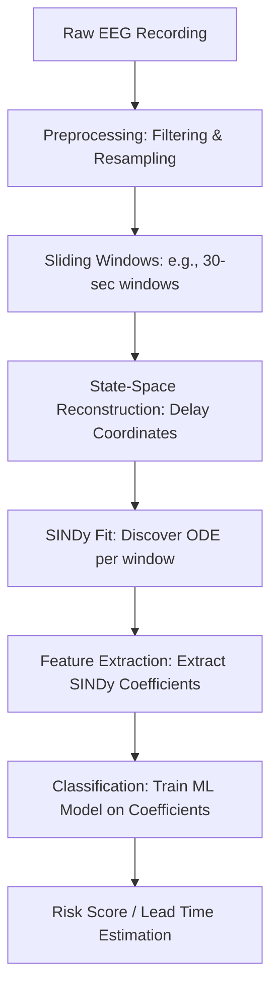

# Feasibility and Implementation Guide: SINDy EEG Seizure Prediction

Is a SINDy-based EEG seizure prediction system scientifically possible, or is it fundamentally flawed? 

The short answer is **yes, it is possible**, but **not using the naive implementation in this repository**. To build a functioning and clinically valid version of this system, you must change the core algorithm design.

---

## 1. Why the Current Approach is Fundamentally Impractical

The current codebase attempts to:
1. Fit a 3-variable polynomial ODE ($\dot{x} = f(x)$ where $x \in \mathbb{R}^3$) directly to raw filtered EEG channels.
2. Integrate this ODE 10 seconds into the future.
3. Use the integration error (MSE) as a signal for seizure detection.

This fails for three physical and mathematical reasons:
* **The Brain is not a 3-Dimensional Closed System**: Raw EEG channels are spatial mixtures of millions of underlying neural dipoles. Three raw channels do not form a closed, autonomous dynamical system. Fitting a standard ODE directly to raw channel values is mathematically invalid.
* **Positive Lyapunov Exponents (Chaos)**: Brain electrical activity is chaotic and non-linear. By definition, chaotic systems exhibit "extreme sensitivity to initial conditions." Even if you have the *perfect* differential equation, small noise in the initial condition will cause the simulation to diverge exponentially. You cannot integrate a chaotic EEG ODE 10 seconds (1,280 steps) into the future and expect it to match the actual signal.
* **Stiffness and Blow-ups**: Polynomial systems of degree 3 are prone to mathematical instability (e.g., $x^3$ terms can lead to infinite blow-up in finite time during integration). This is why the backend code frequently encounters simulation exceptions and has to fall back to dummy errors.

---

## 2. How to Make it Work Correctly (The Feasible Architecture)

Instead of relying on unstable time-domain simulations, a scientifically valid SINDy-based seizure prediction system should track **bifurcations in the brain's dynamics** by analyzing how the *model coefficients* change over time. 

Here is the correct workflow:

### Key Pillars of the Correct Approach:

#### A. State-Space Reconstruction (Delay Embedding)
Before running SINDy, you must reconstruct the attractor of the dynamical system. 
* **Method**: Use **delay-coordinate embedding** (based on Takens' Theorem) or **HAVOK (Hankel Alternative View of Koopman)** analysis. This converts a few EEG channels into a higher-dimensional state-space $X = [x(t), x(t-\tau), x(t-2\tau), \dots]$ where a deterministic ODE can actually represent the dynamics.

#### B. Track Coefficient Drift (No Integration Needed)
Instead of integrating the ODE using `model.simulate()` (which blows up), you fit SINDy to every sliding window and treat the **coefficients** ($\Xi$) as features.
* **Method**: A healthy brain is governed by a stable system (e.g., negative eigenvalues in the linear terms). As a seizure approaches, the brain undergoes a **bifurcation** (e.g., a Hopf bifurcation), where the system becomes unstable. This transition will show up as a structural shift in the discovered equations (e.g., a coefficient changing sign or growing rapidly).

#### C. Machine Learning Classifier
* **Method**: Train a simple, robust classifier (e.g., Random Forest, XGBoost, or SVM) where the input features are the discovered SINDy coefficients of the current window, and the output is the probability of the state being **Preictal** (pre-seizure).
* **Benefit**: This retains the "White-Box AI" claim because you can tell the clinician: *"The model predicts a seizure because the cubic coupling coefficient between the temporal and frontal lobes has crossed the instability threshold of $+0.4$."*

---

## 3. Project Difficulty Assessment

Developing this system correctly is highly feasible, but it requires a solid understanding of dynamical systems and statistical learning.

| Phase | Task | Difficulty | Time Estimate | Key Skills / Tools |
| :--- | :--- | :--- | :--- | :--- |
| **Data & Prep** | Downscaling EEG, downloading CHB-MIT datasets, and filtering. | **Easy** | 1–2 Days | `mne-python`, `scipy.signal` |
| **SINDy Modeling** | Implementing delay embeddings (HAVOK) and sliding-window PySINDy fitting. | **Hard** | 1–2 Weeks | `pysindy`, Dynamical Systems Theory |
| **Classification** | Training a classifier on coefficient trajectories to predict seizures. | **Medium** | 3–5 Days | `scikit-learn`, XGBoost, ROC-AUC |
| **Web System** | FastAPI backend + Chart.js dashboard integration. | **Medium** | 3–4 Days | FastAPI, HTML5/CSS, WebSockets |

### Overall Difficulty: **High-Medium**
* The **software engineering** aspect (making the FastAPI server and CSS dashboard) is straightforward.
* The **scientific/algorithmic** aspect (optimizing SINDy thresholds, dealing with noise, preventing model overfitting, and building a robust state space) is a advanced machine learning research problem.

---

## 4. Immediate Action Plan to Fix this Repository

If you want to salvage the current project and make it a functional prototype without doing full-scale clinical research, you can implement this **hybrid solution**:

1. **Fix the Derivative Scaling**: Set `delta=1/128` in `savgol_filter` so the ODE runs at the correct physical speed.
2. **Reduce Simulation Horizon**: Instead of integrating for 10 seconds (1280 steps), integrate the model for only 0.25 seconds (32 steps) starting from the beginning of each window. Compare this short-term prediction to the actual signal. Short-term integration is much more stable and won't blow up.
3. **Separate Baseline vs. Test Files**: Modify the backend to load a known normal file to train SINDy, and then feed a separate test file to evaluate prediction error.
4. **Dynamic Seizure Spotting**: Implement a simple threshold on the moving-average variance of the signal to identify the *actual* seizure onset, rather than hardcoding it to `297`.
